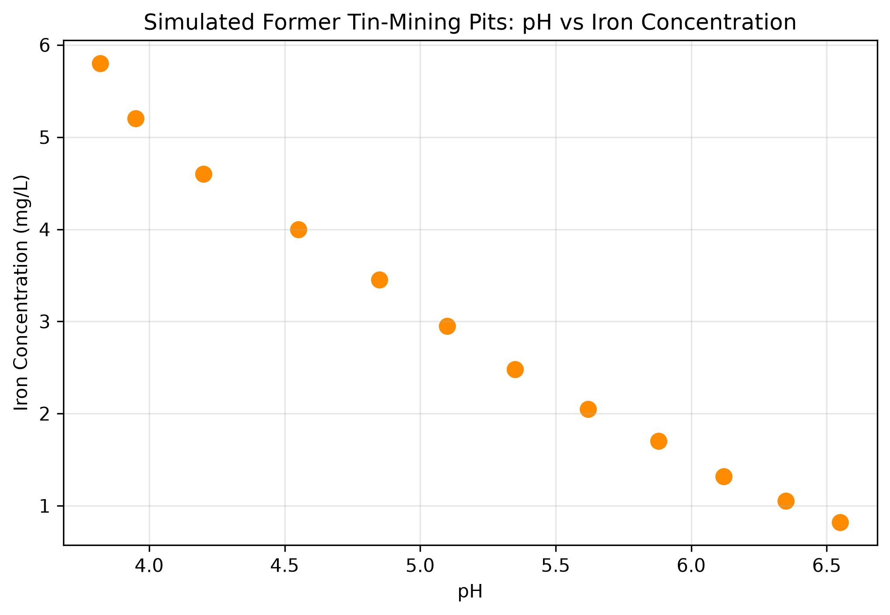
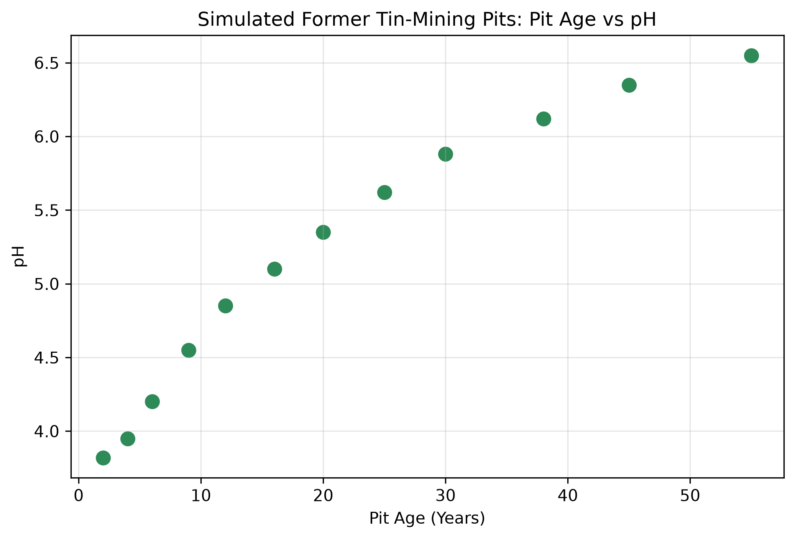
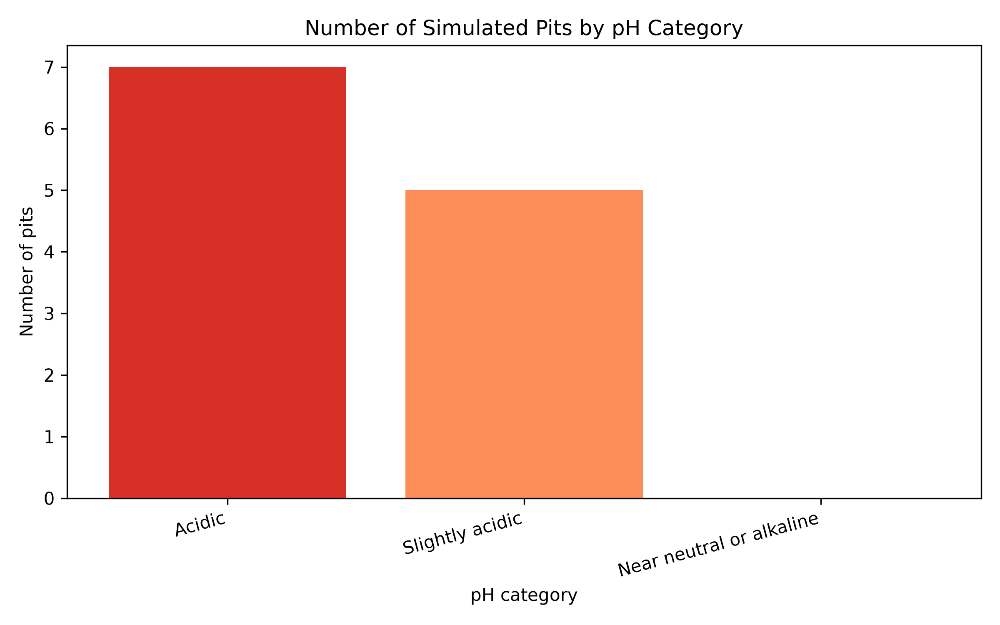

# Simulated Water-Quality Analysis of Former Tin-Mining Pits

A beginner Python project that analyzes a simulated water-quality dataset representing former tin-mining pits (*kolong*) in Bangka Belitung, Indonesia.

> **Important:** This repository uses simulated data for educational purposes. It does not contain field measurements and must not be used to draw conclusions about real locations or environmental conditions.

## Project goal

This project was created to practice a basic environmental-data-analysis workflow using Python:

- Read a CSV dataset with Pandas.
- Inspect data structure and missing values.
- Calculate descriptive statistics.
- Identify the lowest pH and highest iron concentration.
- Explore correlations among water-quality variables.
- Create and save scatter-plot visualizations.
- Export summary statistics as a CSV file.

## Dataset

The simulated dataset contains records for 12 former tin-mining pits. Variables include:

| Variable | Unit | Description |
|---|---:|---|
| `pit_name` | — | Identifier for each simulated pit |
| `pit_age_years` | years | Simulated age of the pit |
| `pH` | — | Acidity/alkalinity indicator |
| `dissolved_oxygen_mg_L` | mg/L | Dissolved oxygen concentration |
| `turbidity_NTU` | NTU | Water-cloudiness indicator |
| `TDS_mg_L` | mg/L | Total dissolved solids |
| `iron_mg_L` | mg/L | Iron concentration |
| `manganese_mg_L` | mg/L | Manganese concentration |

The data file is available in:

```text
water_data.csv
```

## Repository structure

```text
.
├── analysis.py
├── README.md
├── learning_log.md
├── requirements.txt
├── .gitignore
├── water_data.csv
├── water_quality_summary.csv
├── ph_vs_iron.png
├── pit_age_vs_ph.png
└── ph_category_count.png
```

## How to run

### 1. Create and activate a virtual environment

```powershell
python -m venv venv
Set-ExecutionPolicy -Scope Process -ExecutionPolicy RemoteSigned
.\venv\Scripts\Activate.ps1
```

### 2. Install dependencies

```powershell
pip install -r requirements.txt
```

### 3. Run the analysis

```powershell
python analysis.py
```

The script reads `water_data.csv`, prints basic analysis results in the terminal, saves descriptive statistics to `water_quality_summary.csv`, and generates three plots.

## Outputs

### pH versus iron concentration

`ph_vs_iron.png` visualizes the relationship between pH and iron concentration in the simulated dataset.



### Pit age versus pH

`pit_age_vs_ph.png` visualizes the relationship between pit age and pH in the simulated dataset.



### pH-category distribution

`ph_category_count.png` summarizes the number of simulated pits within three descriptive pH categories. These categories are used only for exploratory visualization and are not regulatory water-quality classifications.



## Main observations

- The pH-category chart summarizes the distribution of simulated pits across acidic, slightly acidic, and near-neutral/alkaline categories.

Based only on this simulated dataset:

- `Kolong_01` has the lowest pH value: 3.82.
- `Kolong_01` has the highest iron concentration: 5.80 mg/L.
- The pH-versus-iron plot shows an inverse pattern in this simulation.
- The pit-age-versus-pH plot shows pH increasing with pit age in this simulation.

These observations are examples of data exploration, not evidence about actual former tin-mining pits.

## Tools

- Python
- Pandas
- Matplotlib
- Visual Studio Code
- Git and GitHub

## Learning notes

See [`learning_log.md`](learning_log.md) for a short record of the Python, data-analysis, and Git/GitHub skills practiced during this project.

## Future improvements

- Use verified field data with appropriate permissions and metadata.
- Add sampling dates, coordinates, and site descriptions.
- Conduct formal water-quality interpretation using relevant standards.
- Add data validation and reproducible environment files.
- Create maps and explore remote-sensing data for broader environmental analysis.

## Author

Aliefia Noor